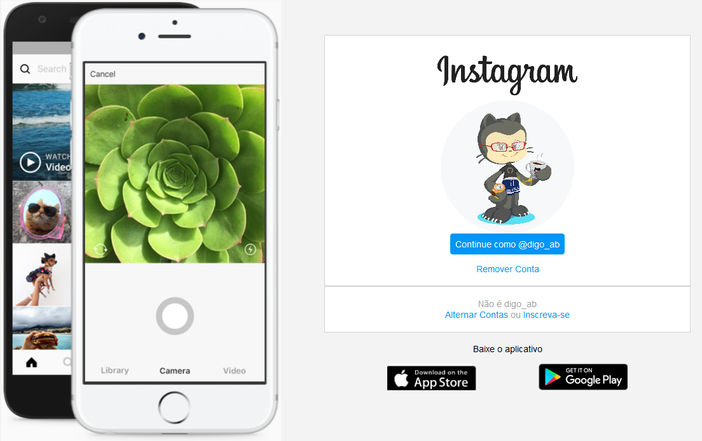
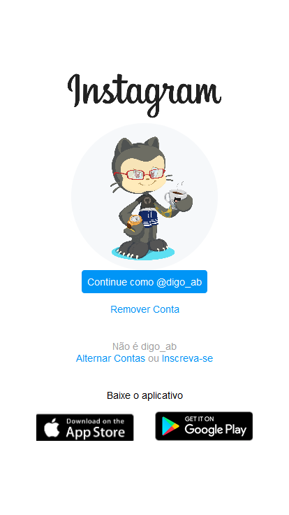

#CloneInstagram  

**Clone** realizado durante bootcamp 

Foi realizado o clone do Instagram para PC:  

 

Logo após foi adaptado para telefone,aplicando responsividade: 

 

Durante o desenvolvimento foi utilizado HTML e CSS podendo ser rodado com a extensão GoLive ou o Xaamp.